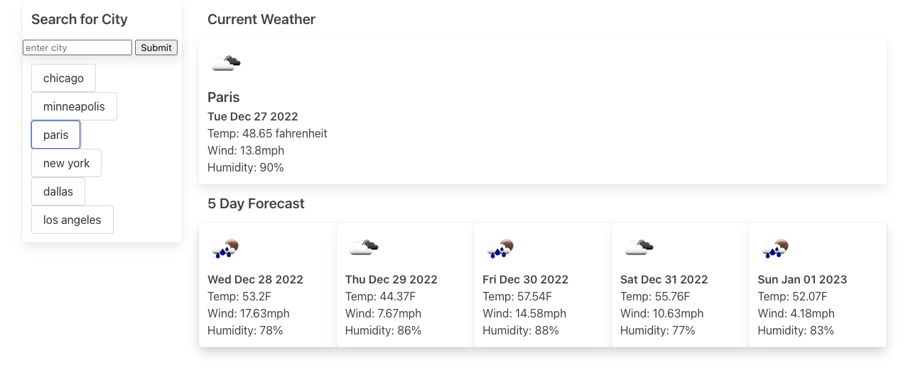

# weather_dashboard

## Description

A weather app that shows a 5-day forecast for the selected city. No starter code was provided. See the [Acceptance Criteria](#acceptance-criteria).

To view the deployed website, click [here](https://box-o-water.github.io/weather_dashboard/).



## Future Enhancements

* the free api forecast call brings back 5 days worth of 3-hour windows, therefore making it gross to get a daily forecast; as this weather app is reasonably basic and short-term and as the apikey is currently visible, elected to NOT provide financial information to use one of api options which would have provided a daily forecast
* replace plain text apikey with a secure solution
* add ability to pick correct city if duplicates exist (zip; city, state; provide a list; etc)

## Our Task

Third-party APIs allow developers to access their data and functionality by making requests with specific parameters to a URL. Developers are often tasked with retrieving data from another application's API and using it in the context of their own. Your challenge is to build a weather dashboard that will run in the browser and feature dynamically updated HTML and CSS.

Use the [5 Day Weather Forecast](https://openweathermap.org/forecast5) to retrieve weather data for cities. The base URL should look like the following: `https://api.openweathermap.org/data/2.5/forecast?lat={lat}&lon={lon}&appid={API key}`. After registering for a new API key, you may need to wait up to 2 hours for that API key to activate.

**Hint**: Using the 5 Day Weather Forecast API, you'll notice that you will need to pass in coordinates instead of just a city name. Using the OpenWeatherMap APIs, how could we retrieve geographical coordinates given a city name?

You will use `localStorage` to store any persistent data. For more information on how to work with the OpenWeather API, refer to the [Full-Stack Blog on how to use API keys](https://coding-boot-camp.github.io/full-stack/apis/how-to-use-api-keys).

## User Story

```
AS A traveler
I WANT to see the weather outlook for multiple cities
SO THAT I can plan a trip accordingly
```

## Acceptance Criteria

```
GIVEN a weather dashboard with form inputs

WHEN I search for a city
THEN I am presented with current and future conditions for that city and that city is added to the search history

WHEN I view current weather conditions for that city
THEN I am presented with the city name, the date, an icon representation of weather conditions, the temperature, the humidity, and the wind speed

WHEN I view future weather conditions for that city
THEN I am presented with a 5-day forecast that displays the date, an icon representation of weather conditions, the temperature, the wind speed, and the humidity

WHEN I click on a city in the search history
THEN I am again presented with current and future conditions for that city
```
## Mock-Up

The following animation demonstrates the application functionality:


## License

Licensed under the [MIT](/LICENSE) license.
